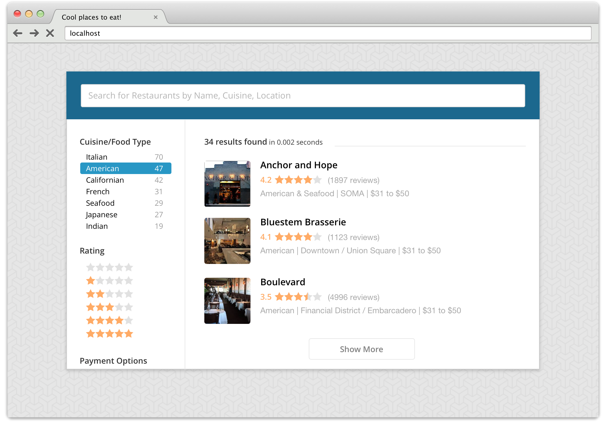

# Front-End Engineer Hiring Assignment

This is the hiring assignment for the E-commerce Front-End developer role at Algolia.
It&rsquo;s intended to mimic work you might do here, while giving us an understanding of your skills in:

- Coding
- User Experience

If you want to know how we will judge the assignment, you can [view our scoring card](./SCORING.md).

## Tech and UX Project Instructions

As a front-end dev, you&rsquo;re asked to build a small prototype that &mdash; using the dataset and UI provided &mdash; highlights the benefits of a great search experience.

- Push the provided dataset to an Algolia index
- Produce the HTML markup and CSS needed to reproduce the UI provided by the client. To do so, you can write vanilla CSS or with a processor of your choice.
- Using the [Algolia JS Helper](https://community.algolia.com/algoliasearch-helper-js/) and without using instantsearch.js, implement an as-you-type search experience that enables users to easily find restaurants: both by passing a search query and/or filtering on the &ldquo;type of cuisine&rdquo;
- Leverage the user&rsquo;s location to show restaurants closer to them higher in the results&mdash;with a fallback if they dont&rsquo;t allow for geolocation permissions in the browser

  *Screenshot of a target UI*

#### Important Notes

- Don't fork the repository, simply create a new one
- Graphical resources, including the Sketch mock-up, are provided in the [`mockups/`](./mockups) folder
- The mock-up is meant to serve as guidance -- if you have a UI/UX that you believe improves upon the mock-up, feel free to implement it, and be ready to explain your choice to do so
- The dataset given by the client is available in the [`dataset/`](./dataset) folder. They have been able to extract 5000 restaurants from their database: [`restaurants.json`](./dataset/restaurants.json).
- Feel free to use any front-end tooling with which you&rsquo;re most comfortable
- The blue highlight in the sidebar is an active/hover state
- For payment options, we should **only** have: AMEX/American Express, Visa, Discover, and MasterCard
  - For our purpose, Diners Club and Carte Blanche are Discover cards
- When you sign up for an Algolia account, please put `Interview Candidate` in the company field
  - This helps our sales team know someone's already speaking with you

#### Deliverable

Once you're happy with what you've done

- Publish it using GitHub's gh-pages so we can interact with it
- Send us a link to your finished project via email
- Follow at least the instructions above, but feel free to go beyond if you have ideas &mdash; wow us!

Happy coding!

Note: The provided dataset has been created using the https://github.com/sosedoff/opentable project.
Note: Assignment heavily inspired by the [Solutions Engineer assignment](https://github.com/algolia/solutions-hiring-assignment).
